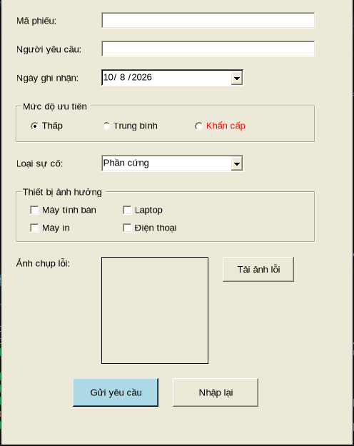
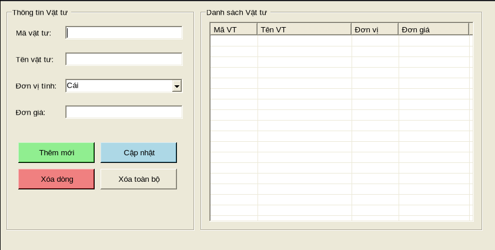
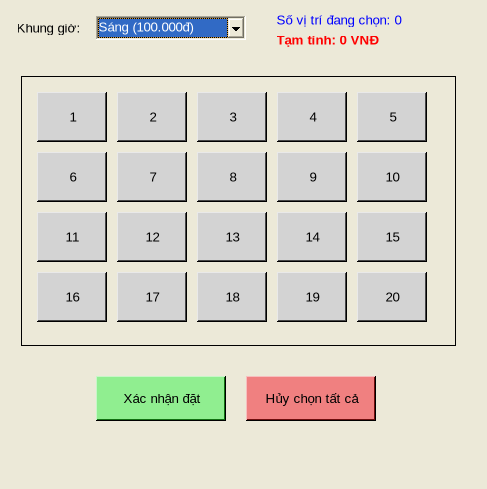
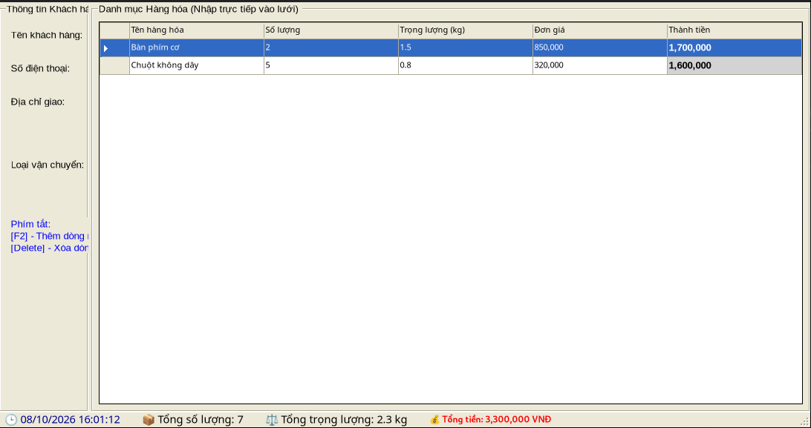

Markdown
# BÁO CÁO BÀI TẬP / ĐỒ ÁN

## THÔNG TIN SINH VIÊN
- **Họ và tên:** Hoàng Gia Hưng
- **Mã số sinh viên:** 24810320102
- **Lớp:** D19QTANM1
- **Tên môn học:** Lập trình C# / Windows Forms
- **Tên bài tập:** BÀI1, BÀI2, BÀI3, BÀI4, BÀI5 BÀI TẬP ÔN TẬP NGÀY 8/10
## 📁 Danh sách bài tập & Kết quả chạy

### 1. Bài 1: Calculator (`bai1_calculator`)

### 2. Bài 2: IT Support (`bai2_itsupport`)

### 3. Bài 3: Item Manager (`bai3_itemmanager`)

### 4. Bài 4: Slot Booking (`bai4_slotbooking`)

### 5. Bài 5: Delivery Dashboard (`bai5_deliverydashboard`)

